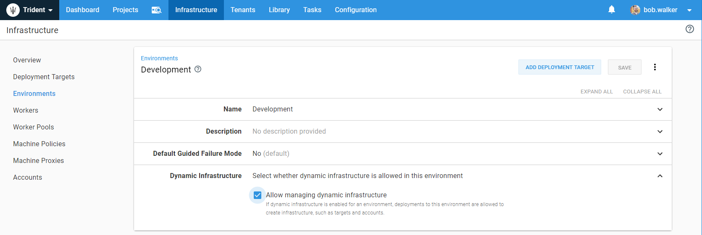
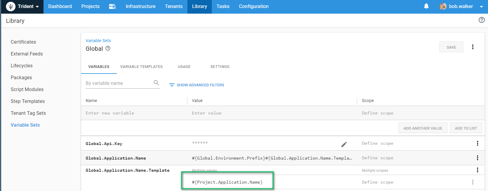
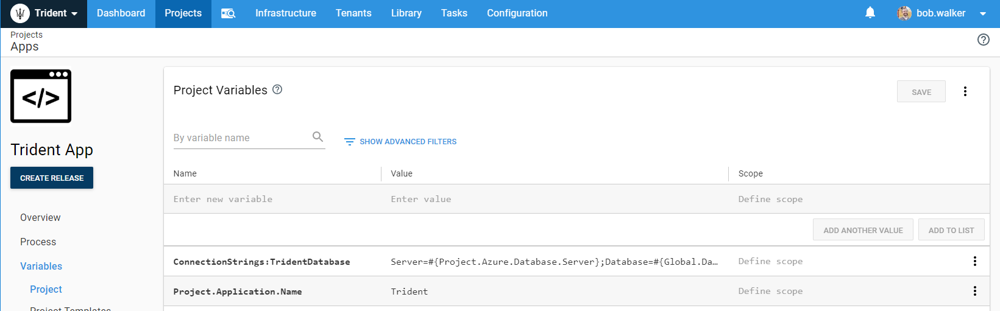
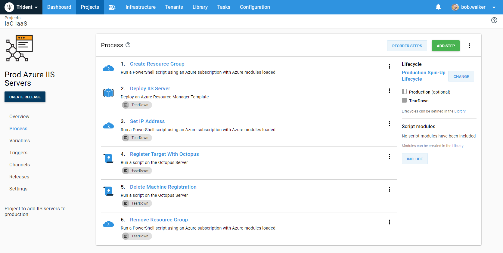
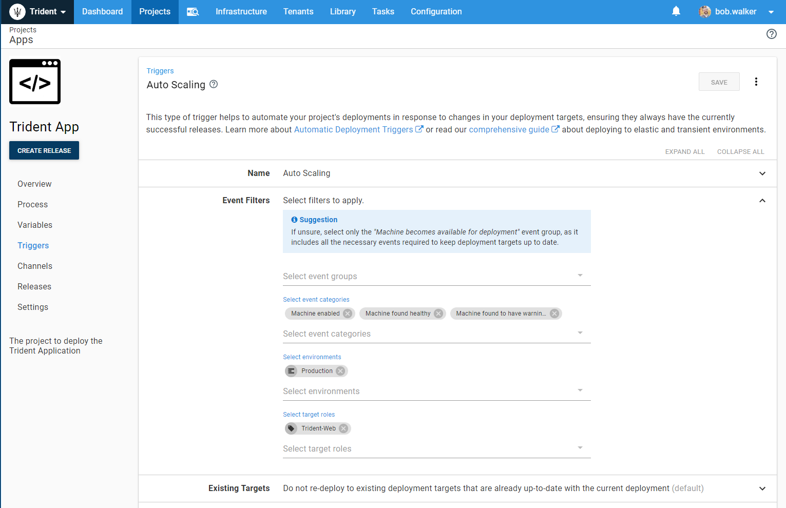
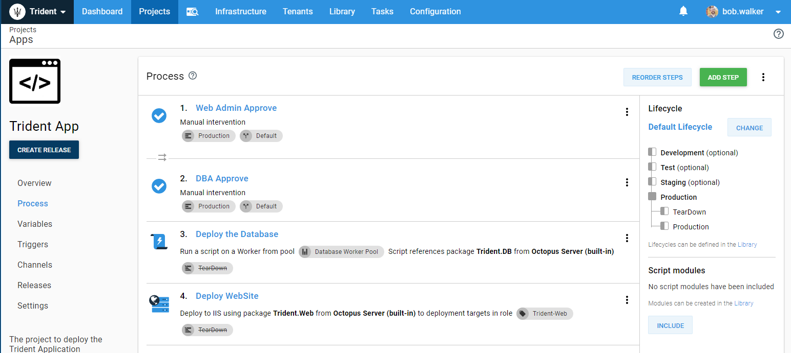
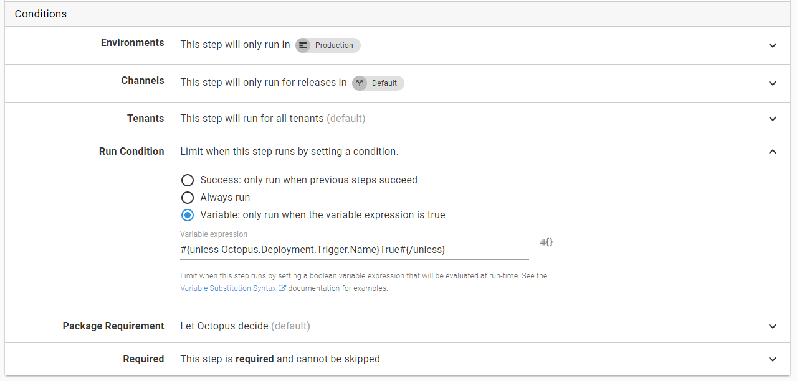
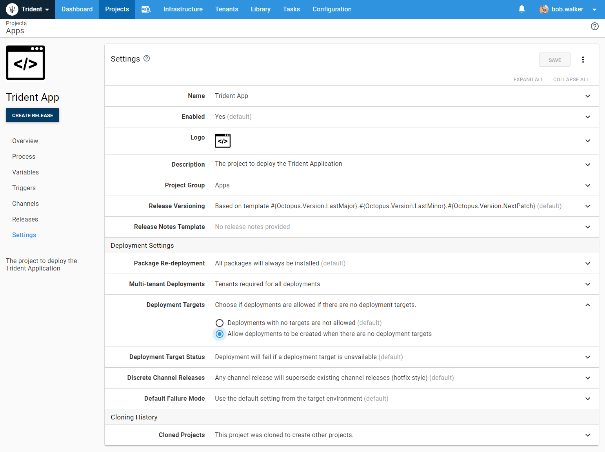

Infrastructure as Code (IaC) allows you to define your infrastructure using a common language, such as JSON or YAML, and store it in a file. That file can be included as part of your deployment.  In this section, we will walk you through some core concepts of IaC.  Later we will discuss how to configure Octopus Deploy to leverage infrastructure as code.  In later sections, we will go through some common real-world scenarios.

This section uses several features which were added throughout 2018 and 2019.  To take full advantage of infrastructure as code, we recommend you are running the latest Long Term Support (LTS) version of Octopus Deploy.  

## Background

Imagine you have been working on a new feature in your application for a few weeks, and it is now time to get some feedback.  The code isn't finished; it is in a state where you can get some feedback to determine if you are on the right track.  Where do you deploy that code?  You don't want to deploy on top of your current install on your testing servers.  That could break all the testing.  You also don't want to have people connect to your machine.  The people whom you want to get feedback from are not in the office today, and you want to keep working on the code.  When your co-workers are ready to give you feedback, and they connect to your machine, the code could be in a broken state.  In an ideal world, you would spin up some new infrastructure, deploy to new infrastructure to get feedback.  Once everyone is done testing the new feature, that infrastructure is deleted.

So you go to operations to ask them to create a new virtual machine (VM).  They hand you a form to fill out.  That form has several fields to fill out.   Windows or Linux, RAM and CPU, testing or production, and what applications need to be installed on the machine, to name a few.  You dutifully fill it out and hand it back to them.  Due to a variety of reasons, it takes almost a week to get the new VM.  Other priorities took precedence, and your request was pushed to the back of the list.  

It took a long time to get those VMs.  As a developer, you are reluctant to give them up.  Operations are also reluctant to destroy them because you might come back in a few weeks after it is destroyed and ask for a new VM.  So the VM lives on for a long time.  Now you have to worry about keeping that server up to date.  

### Cattle Not Pets

The VM in the above example essentially became a pet.  You have to care for it because it is going to live for a long time.  What we want to do is treat the VM like a rancher treats cattle.  Compared to a pet, cows live for a short amount of time and are replaced quickly.  A cow is sold to market, a new cow comes and takes its place.  We want to treat our infrastructure the same way.  Treating your VM as cattle and not a pet is accomplished by leveraging Infrastructure as Code.

### Tooling

How you leverage IaC depends on where you host your code.  If you are hosting your code using a cloud provider, such as Azure, AWS, or Google Cloud, then they provide a rich API and tooling for you.  If you are hosting on-premise, then chances are your operations team has migrated as many physical servers over to hypervisors.  In that case, you will have to refer to the documentation of your company's hypervisor(s) of choice.

## Core Concepts and Recommendations

Before jumping into configuration and other changes, you will need to make to Octopus Deploy, take a step back, and answer this fundamental question.  Why do you want to leverage IaC?  Do you want to be able to auto-scale production to handle additional traffic?  Do you want to deploy the latest code to a DR site in the event your primary data center goes offline?  Do you want to provide each of your developers with a testing sandbox?  When should a teardown event occur on the infrastructure?  Who should be the one who triggers it? 

### Long Living Resources

In most IaC demos the entire infrastructure, from the SQL Server to the network, to the Web Server get created on the fly.  In the real world, having your entire infrastructure spun up and torn down is not feasible.  For example, if you were using a cloud provider such as Azure or AWS, you might have a virtual network configured with a point to point VPN.  A point to point VPN allows you to configure all your testing servers to have no public IP addresses, but you could still access them.  In our experience, tearing down a VPN connection like that is risky (dropping the VPN means you cannot connect to those test VMs anymore), and error-prone.  Firewalls have to be configured just so.  

Besides, it is unlikely you will want to spin up and down database servers on the fly, especially when it is in a production environment.  We have seen several companies who eventually get to this, but it is not something did day one.  

The point is, you will have long living resources.  We recommend identifying those resources and isolating them from your IaC when possible.  For example, in Azure, you can have virtual networks in one resource group and create a separate resource group as part of your IaC deployments.  When you want to delete all the IaC resources, you delete the IaC resource group you created as part of your deployment.

### Databases

Databases were mentioned in the earlier section, but we wanted to address them again.  When working through your scenarios, consider where that data is coming from.  If you are building testing sandboxes for feature branches, how will the database be populated?  Backup and restore?  Using a third-party tool such as SQL Clone?  Seed scripts?  What about using IaC for disaster recovery?  Will you configure high availability in SQL Server and use a virtual IP address?  We can't answer those questions for you as we don't know your configuration and requirements.  We wanted to bring them up now so you can think about them now rather than running into them later.  

### Bootstrap VMs

If you opt to leverage VMs instead of PaaS services such as Azure Web Apps or Kubernetes clusters, then you should automate the install of the tentacle using a bootstrap script.  That script should also install any additional applications.  Please take a look at our other documentation on how to [automate the tentacle installation](https://octopus.com/docs/infrastructure/deployment-targets/windows-targets/automating-tentacle-installation).  

When using Windows VMs, we recommend leveraging [Chocolatey](https://chocolatey.org/).  .NET has NuGet packages, Chocolatey is NuGet packages, but for Windows, not .NET.  We also recommend leveraging [Deployment Imaging Servicing and Management](https://docs.microsoft.com/en-us/windows-hardware/manufacture/desktop/dism---deployment-image-servicing-and-management-technical-reference-for-windows), otherwise known as DISM for Windows.  With Chocolatey and DISM, you should be able to configure Windows automatically to your liking.

Your Linux Distro of choice should already have a package manager built in.  You will need to refer to the documentation on your Linux Distro to get those specific commands.  If you wish to use a tentacle on Linux, please refer to our documentation on how to [bootstrap the Linux tentacle](https://octopus.com/docs/infrastructure/deployment-targets/linux/tentacle).

## Configuring Octopus Deploy to leverage Infrastructure as Code

The previous section addressed some core concepts as well as some recommendations to consider when you are getting started with IaC.  In this section, we want to discuss some configuration changes you will need to make to Octopus Deploy to support Infrastructure as Code.

### Environments and Lifecycles

Your scenario will influence your environment and lifecycle configuration.  Especially f you are going to be running your IaC process through Octopus Deploy.  We recommend running your IaC process through Octopus Deploy.  However, you might be leveraging technology such as auto-scaling groups or virtual machine scale sets.  In that case, it doesn't make sense to go through Octopus Deploy.  

If you are running your IaC process through Octopus Deploy, we recommend creating a `TearDown` environment.  In your IaC process, you will deploy to that environment to de-register any deployment targets from Octopus Deploy and to delete the resources.  Creating that environment will require you it to your lifecycles.  For example, if you wanted to scale out production, your lifecycle for that would be:

1. Production
2. TearDown

When you introduce IaC into your process, you will also have to deal with failures.  Typically, most failures will occur the first time you configure your IaC process.  Although rare, a random failure when deploying IaC to Azure or AWS is possible.  We have seen ARM templates deploy half the resources and then fail.  There is no rhyme or reason why failures occurs; it just happens.  You will want to mark any phases before TearDown as optional.  That will allow you to destroy those created resources and quickly try again.

Finally, you will want to configure your Octopus to support dynamic infrastructure for each of your environments.  That is accomplished by going to Infrastructure -> Environments and then clicking on the `...` and selecting Edit.  

### Naming Conventions

You will have to have unique names for everything, especially if you are using active directory or a cloud provider.  While it is possible to get away with assigning every resource a GUID, it isn't something we'd recommend.  It is essential to have clear, concise, naming conventions when using IaC to easily and quickly identify your resources.  Especially when you spinning up and down VMs.  Even though the resource is short lived, you will still want to be able to remote into a VM to debug issues.  

We have found the following naming convention works for a lot of user cases, [Environment Abbreviation]-[Application Abbreviation]-[Resource Purpose]-[Number].  For example, for web servers hosting the OctoFX application:

- Production: p-, IE `p-octofx-web-01` and `p-octofx-web-02`
- Staging: s-, IE `s-octofx-web-01` and `s-octofx-web-02`
- Testing: p-, IE `t-octofx-web-01`
- Development: d-, IE `d-octofx-web-01`

A  really cool feature of Octopus Deploy is variables are calculated at run-time.  That means you can reference a variable in from your project a library variable set.  For example, here is the library variable set "Global," which references the variable, `Project.Application.Name.`

That variable is defined in the projects.

Our recommendation is to create a library variable set or sets to store your naming convention.  In your project have a standard variable or variables, such as `Project.Application.Name,` defined which can be referenced by the library variable set.

### Deployment Process

We've talked about environments, lifecycles, and naming conventions.  Now we can move onto projects.  Regardless of your scenario, your IaC process will typically contain the following steps when spinning up new infrastructure:

1. Create new infrastructure resources.
2. Register new deployment targets with Octopus Deploy.
3. Deploy to new deployment targets.

If your scenarios need to tear down the infrastructure when it is no longer needed, then you need to do the following:

1. De-register the deployment targets with Octopus Deploy
2. Destroy or teardown any new infrastructure resources

If you did this all in a single project your deployment process would look something like this:

Depending on your scenario, it is entirely possible for those steps to occur outside of Octopus Deploy.  If you were leveraging [Virtual Machine Scale Sets](https://docs.microsoft.com/en-us/azure/virtual-machine-scale-sets/overview) in Azure or [Auto Scaling Groups](https://docs.aws.amazon.com/autoscaling/ec2/userguide/AutoScalingGroup.html) in AWS, the cloud providers would spin up and down your infrastructure.  You would need to configure the bootstrap script to register the new machines.  When it comes to destroying the machines, you would call and an Azure Function or AWS Lambda function to call the Octopus API to de-register the machines from Octopus Deploy.

In other scenarios, it makes sense to leverage Octopus Deploy with IaC.  Octopus Deploy has built in steps to deploy Azure Resource Manager (ARM) templates, Cloud Formation Templates - for AWS.  Octopus Deploy also supports TerraForm templates - which can deploy to both Azure and AWS.  If we don't provide the built-in steps, you can easily script them out using PowerShell or Bash.  If you go that route, check out our [community library](https://library.octopus.com) to see if someone from the community has written something.  

### Deployment Target Triggers

The final piece of the puzzle will be getting the latest and greatest code deployed to the new deployment targets after they are created.  That is accomplished by [deployment target triggers](https://octopus.com/docs/deployment-process/project-triggers/automatic-deployment-triggers) in Octopus Deploy.  For example, with this trigger, it will deploy the latest release in production when a web server is found with the role `Trident-Web.`

In the above screenshot, the trigger is only worried about web servers.  However, the deployment process has manual interventions and a database deployment.  When that trigger runs, steps 1, 2, and 3 should be skipped.  The deployment was already approved when it first went out.  It doesn't make sense to redeploy the database changes as they have already gone out as well.  

We have introduced a new system variable in Octopus Deploy called `Octopus.Deployment.Trigger.Name.`  That variable contains the name of the trigger (when a trigger started the deployment).  Using Octopus Deploy's run conditions, we can prevent steps 1, 2, and 3 from running when a trigger started the deployment.  

It is a bit of a double negative.  How to read that is: when a person or a service account start a deployment, run this step.  When a trigger triggers it, skip this step.

### Deployments with no targets

It is common for targets to be created as part of a deployment.  By default, Octopus Deploy will not allow that.  When Octopus Deploy was created, it was written with the assumption the servers would always be there.  If the servers were not there, then throw an error because something terrible has happened.  Some of our customers still expect that behavior; we didn't want to break them.  We introduced the project setting to allow releases to be deployed if no targets were present.  If your scenario has Octopus Deploy creating the deployment targets as part of the deployment, then you will need to enable this setting.  

## Scenarios

Using these core concepts and configurations we have put together some guides on common scenarios we have encountered.  Either through helping customers or with our own Octopus Deploy setups.  We don't expect to cover every last scenario possible.  But we do expect this list to grow as time goes on and we add new functionality.