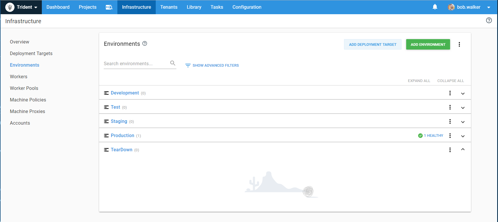
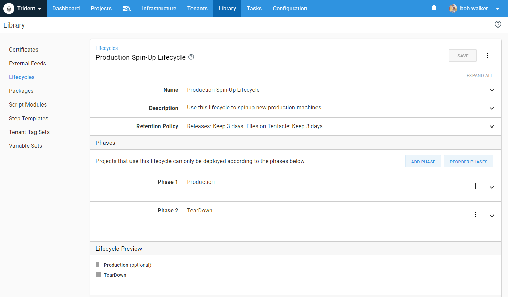

Scaling out virtual machines is commonly associated with an increase in traffic.  Sometimes that increase in traffic is known ahead of time.  If you work in retail, then you know the holiday season has an increase in traffic.  Or, when a general election occurs.  Sometimes you don't know when a spike in traffic will occur.  It could be a random social media post or article written about your product.  

Typically, we see companies manually scale up their infrastructure when they know an increase in traffic will occur.  They want to ensure they have capacity to handle that, and the best way to ensure there is capacity is to set it up and test it.  The holiday season is important to a retail company, and they want to ensure a smooth experience for their users.  New virtual machines are created a month or so in advance and load tests are run.  This guide will walk you through on how to configure Octopus Deploy to manually scale out virtual machines.  

## Prep Work

The intro document to this section went through some core concepts of Infrastructure as Code.  One of the biggest core concepts is the overall process of scaling up the infrastructure.  Regardless if you are in the cloud or on-premise the process will be the same.  

1. Create new infrastructure resources.
2. Register new deployment targets with Octopus Deploy.
3. Deploy to new deployment targets.

In this guide, Octopus Deploy will be responsible for tearing down your infrastructure when it is no longer needed.  That will look like:

1. De-register the deployment targets with Octopus Deploy.
2. Destroy or teardown any new infrastructure resources.

When you create the VMs you will need a script to bootstrap the installation of the tentacle.  In terms of prep work, that should be one of the first items you tackle.  You will want that script rock solid.  That way you only need to worry about scripting out the creation of the VMs.  Below is a sample script which will download the latest tentacle instance and install it for a Windows VM.  This script also leverages Chocolatey and DISM to configure the server.

```PS
    Param(    
        [string]$octopusServerThumbprint,    
        [string]$instanceName,		
        [string]$chocolateyAppList,
        [string]$dismAppList	
    )

    Start-Transcript -path "C:\Bootstrap.txt" -append  

    Write-Output "Thumbprint: $octopusServerThumbprint"  
    Write-Output "InstanceName: $instanceName"
    Write-Output "ChocolateyAppList: $chocolateyAppList"
    Write-Output "DismAppList: $dismAppList"

    function Get-FileFromServer 
    { 
        param ( 
        [string]$url, 
        [string]$saveAs 
        ) 

        Write-Host "Downloading $url to $saveAs" 
        [Net.ServicePointManager]::SecurityProtocol = [Net.SecurityProtocolType]::Tls12 
        $downloader = new-object System.Net.WebClient 
        $downloader.DownloadFile($url, $saveAs) 
    } 

    $OctoTentacleService = Get-Service "OctopusDeploy Tentacle" -ErrorAction SilentlyContinue

    if ($OctoTentacleService -eq $null)
    {
        $tentacleListenPort = 10933 
        $tentacleHomeDirectory = "C:\Octopus" 
        $tentacleAppDirectory = "C:\Octopus\Applications" 
        $tentacleConfigFile = "C:\Octopus\Tentacle\Tentacle.config"  
        $tentacleDownloadPath = "https://octopus.com/downloads/latest/WindowsX64/OctopusTentacle" 	
        
        $tentaclePath = "C:\Tools\Octopus.Tentacle.msi" 

        Write-Output "Beginning Tentacle installation"     

        Write-Output "Downloading latest Octopus Tentacle MSI..." 

        $tentaclePath = $ExecutionContext.SessionState.Path.GetUnresolvedProviderPathFromPSPath(".\Tentacle.msi") 
        if ((test-path $tentaclePath) -ne $true) { 
        Get-FileFromServer $tentacleDownloadPath $tentaclePath 
        } 

        Write-Output "Installing MSI" 
        Start-Process -FilePath "msiexec.exe" -ArgumentList "/i Tentacle.msi /quiet" -Wait -Passthru    
        
        Write-Output "Open port $tentacleListenPort on Windows Firewall" 
        & netsh.exe firewall add portopening TCP $tentacleListenPort "Octopus Tentacle" 
    
        Set-Location "${env:ProgramFiles}\Octopus Deploy\Tentacle" 
        Write-Output "Creating the octopus instance"
        & .\tentacle.exe create-instance --instance "Tentacle" --config $tentacleConfigFile --console | Write-Output
            
        Write-Output "Configuring the home directory"
        & .\tentacle.exe configure --instance "Tentacle" --home $tentacleHomeDirectory --console | Write-Output
            
        Write-Output "Configuring the app directory"
        & .\tentacle.exe configure --instance "Tentacle" --app $tentacleAppDirectory --console | Write-Output
            
        Write-Output "Configuring the listening port"
        & .\tentacle.exe configure --instance "Tentacle" --port $tentacleListenPort --console | Write-Output
            
        Write-Output "Creating a certificate for the tentacle"
        & .\tentacle.exe new-certificate --instance "Tentacle" --console | Write-Output
            
        Write-Output "Trusting the certificate $octopusServerThumbprint"
        & .\tentacle.exe configure --instance "Tentacle" --trust $octopusServerThumbprint --console | Write-Output
        
        Write-Output "Finally, installing the tentacle"
        & .\tentacle.exe service --instance "Tentacle" --install --start --console | Write-Output
                
        Write-Output "Tentacle commands complete"     
    } else {
    Write-Output "Tentacle already exists"
    }    

    if ([string]::IsNullOrWhiteSpace($chocolateyAppList) -eq $false -or [string]::IsNullOrWhiteSpace($dismAppList) -eq $false)
    {
        try{
            choco config get cacheLocation
        }catch{
            Write-Output "Chocolatey not detected, trying to install now"
            iex ((New-Object System.Net.WebClient).DownloadString('https://chocolatey.org/install.ps1'))
        }
    }

    if ([string]::IsNullOrWhiteSpace($chocolateyAppList) -eq $false){	
        Write-Host "Chocolatey Apps Specified, installing chocolatey and applications"	
        
        $appsToInstall = $chocolateyAppList -split "," | foreach { "$($_.Trim())" }

        foreach ($app in $appsToInstall)
        {
            Write-Host "Installing $app"
            & choco install $app /y | Write-Output
        }
    }

    if ([string]::IsNullOrWhiteSpace($dismAppList) -eq $false){
        Write-Host "DISM Apps Specified, installing chocolatey and applications"	

        $appsToInstall = $dismAppList -split "," | foreach { "$($_.Trim())" }

        foreach ($app in $appsToInstall)
        {
            Write-Host "Installing $app"
            & choco install $app /y /source windowsfeatures | Write-Output
        }
    }

    Write-Output "Bootstrap commands complete"  
```

That is just one script.  You will also need a way to create a new virtual machine.  If you are in the cloud you can leverage the tooling provided by your cloud provider.  If you are on-premise, then you will need to refer to your hypervisor's documentation.  When you are creating this script you will need to consider:

1. When will the VM get added into the load balancer?
2. How will the new VM connect to the network?  Will they be isolated on separate subnets or part of the main subnet?
3. Are there any firewalls or policies which prevent the VM from talking to your database server?  

Finally, you will need scripts to remove all the new virtual machines and their associated resources.  This is where being in the cloud can be beneficial.  With Azure, you can create all your new resources in a resource group.  When it comes time to tear it down, de-register the VMs with Octopus Deploy and delete the resource group.  The same is true for AWS and Cloud Formation.  De-register the servers and tell AWS to delete the Cloud Formation stack you created earlier.  

## Configure Octopus Deploy

With the prep work out of the way, it is time to configure Octopus Deploy.  For this guide, Octopus Deploy will handle spinning up and tearing down the new VMs for `Production.`  

### Create a Teardown Environment

Because Octopus Deploy will be handling all the teardown work, a new `Teardown` environment needs to be added to your environment list.  Creating a new environment will allow you to isolate those steps.  They will only run when you are ready to tear everything down.  The environment itself will not have any deployment targets.  The scripts to teardown your new infrastructure will run either on the Octopus Server or on a worker.



### Create a New Lifecycle

This guide is to spin up new machines in `Production.`  We only want to spin up new machines in `Production` and then tear them down when they are not needed.  To do that, we will need a new lifecycle.  



The `Production` environment should be marked as optional.  That way if anything were to go wrong during the spinup process we can easily delete everything and start over.  It is much easier to start fresh than it is to try to figure out which resources you have and which ones you need to still create.  Also, making `Production` optional will allow you to iterate through your creation scripts.  You want to be sure you can scale out `Production` the first time.  A good way to do that is to start fresh each time you run the scripts.  

### Create Variable Sets

[Variable sets](https://octopus.com/docs/deployment-process/variables/library-variable-sets) allow you to share values between projects.  We recommend creating multiple variable sets.  In the below screenshot there are two variable sets, one to store Azure specific values, and another to store global naming conventions.  


As you build out your process you will find yourself repeating the same variables over and over.  When that happens it is time to move the variable over to a variable set.  From the start, there are some variables which you can see make sense to put in those variable sets right away.

- VM Naming Template
- VM Admin Username
- VM Admin Password
- Resource Group or Cloud Formation Stack Name Templates
- Subnet names (if you need to worry about that)

